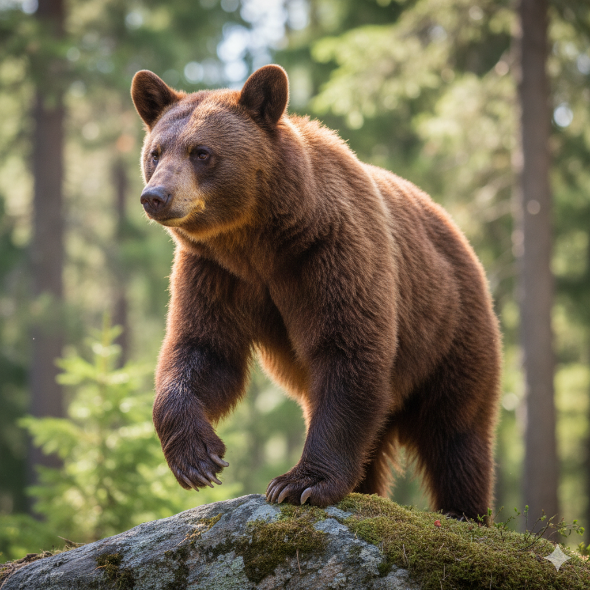
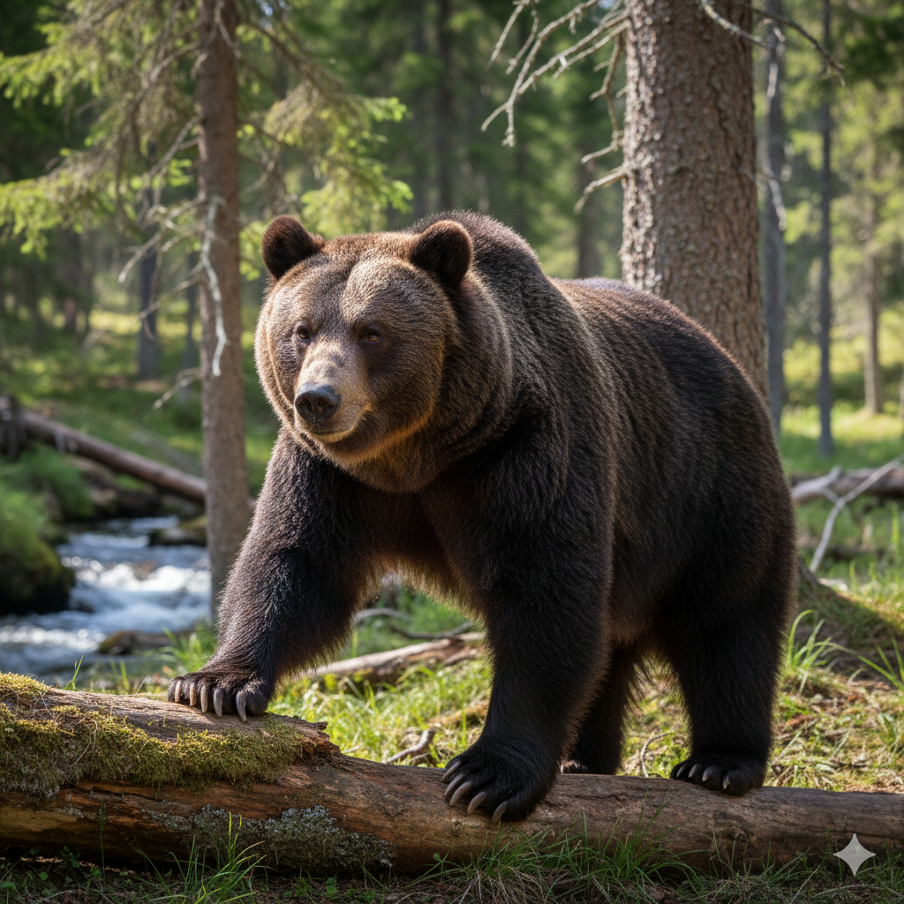
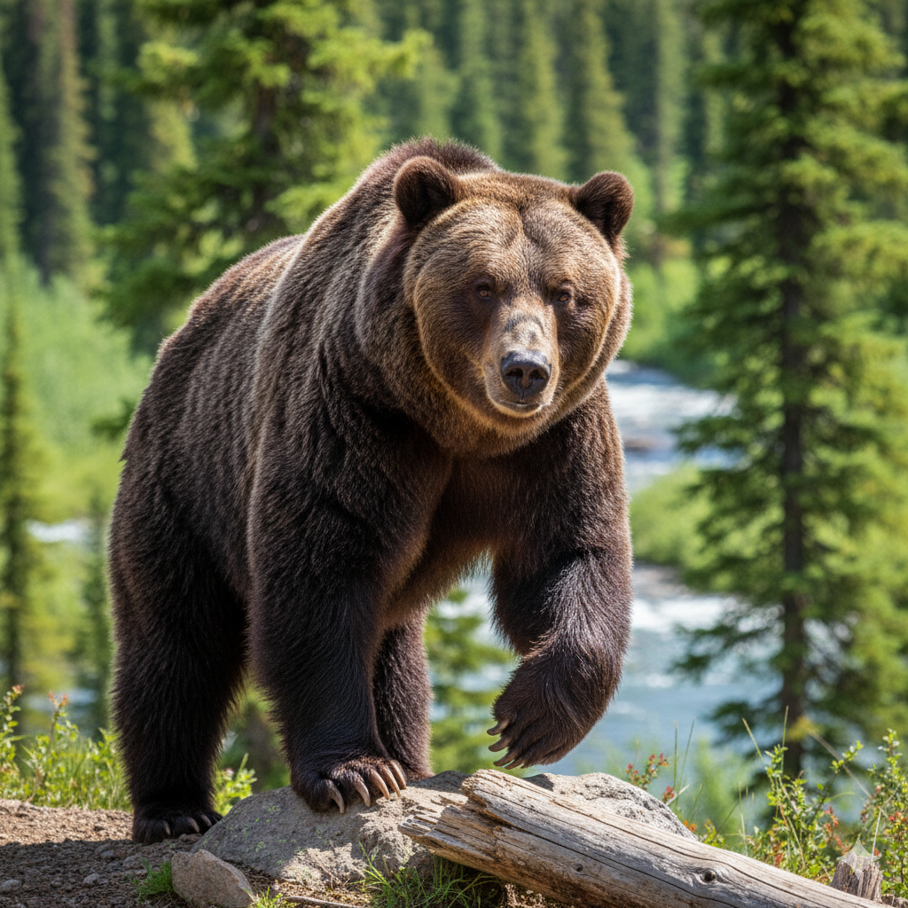
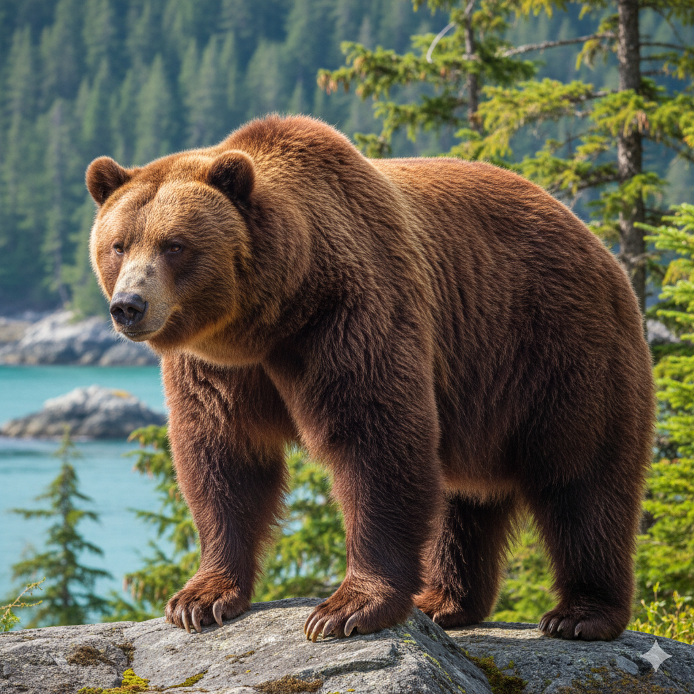

# bear-dataset

This dataset contains both tabular data and images for 200 bears, categorized into four different species. Each species is represented by 50 individual instances, providing a balanced, multi-modal collection for tasks like image classification, feature analysis, and data fusion.

The four species included are:
- American Black Bear
- Eurasian Brown Bear
- Grizzly Bear
- Kodiak Bear

## Dataset Structure
The dataset is composed of two main parts:

1. Tabular Data (`bear_raw_data.csv`): The first portion of the data contains physical measurements for each bear. The columns are as follows:
- ID: A unique identifier for each bear instance.
- Species: The species of the bear.
- Body_Mass_kg
- Shoulder_Hump_Height_cm
- Claw_Length_cm
- Snout_Length_cm
- Forearm_Circumference_cm
- Ear_Length_cm
2. Image Data (`images/` folder): The second portion is a collection of images, where each image corresponds to a unique ID from the tabular data (*e.g.* `ABB_01`, `EUR_01`, `GRZ_01` and `KDK`). This allows for visual analysis and the extraction of image-based features.

<table>
  <tr>
    <td align="center" valign="top" width="25%">
      
      <b>
        American Black Bear
      </b>
    </td>
    <td align="center" valign="top" width="25%">
      
      <b>
        Eurasian Brown Bear
      </b>
    </td>
    <td align="center" valign="top" width="25%">
      
      <b>
        Grizzly Bear
      </b>
    </td>
    <td align="center" valign="top" width="25%">
      
      <b>
        Kodiak Bear
      </b>
    </td>
  </tr>
</table>
